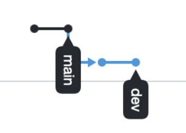

## VCS_task_3

Задача: откатить несколько коммитов в `main` и перенести их в другую ветку - `dev`.

### Команды

```
$ git checkout main
$ git checkout HEAD^^
$ git checkout -b dev
$ git rebase main
$ git checkout main
$ git reset HEAD^^
$ git push -f
$ git checkout dev
$ git push --set-upstream origin dev
```

### Результат

2 последних коммита из `main` были перенесены в новую ветку `dev`.


